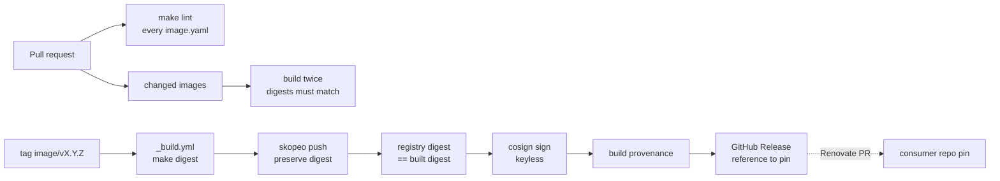

# images — platform-built OCI images for duynhlab

Images the platform builds itself and that are not application services: data or
config shipped as an image, small tool images. Each one is reproducible, signed,
and versioned on its own.

| Quick facts | |
|---|---|
| Registry | `ghcr.io/duynhlab/images/<image>` |
| Versioning | git tag `<image>/vX.Y.Z` → image tag `X.Y.Z` (no `v`), one release line per image |
| Build | `make digest IMAGE=<image>`: BuildKit pinned by digest, `SOURCE_DATE_EPOCH=0`, `rewrite-timestamp=true`, no attestation inside the image |
| Supply chain | cosign keyless signature + SLSA build provenance, both attached to the pushed digest |
| Consumers | pin `<image>:X.Y.Z@sha256:…`; Renovate in the consumer repo proposes new versions |

## Images

| Image | What it is | Consumer |
|---|---|---|
| [`clickhouse-ddl`](images/clickhouse-ddl/) | The ClickHouse OTel schema, mounted read-only at `/sql` as an image volume | homelab `kubernetes/infra/configs/clickhouse-schema/job.yaml` |

## Layout

```text
images/<image>/
  image.yaml      # the contract: name, description, platforms, reproducible, consumers
  Dockerfile      # build context is this directory
  README.md       # what it is, who uses it, how to change it
  CHANGELOG.md    # this image's releases
Makefile          # build | digest | load | lint, all taking IMAGE=<image>
scripts/          # changed-images.sh (PR matrix)
.github/workflows # pr.yml, release.yml, _build.yml (the one shared build)
```

## Workflow



## Add an image

1. Create `images/<image>/` with `image.yaml`, `Dockerfile`, `README.md` and
   `CHANGELOG.md`. Keep `name` equal to the directory.
2. `make lint && make digest IMAGE=<image>`; set `reproducible: true` only if
   two clean builds give the same digest.
3. Open a pull request. CI lints all contracts and builds the touched images twice.
4. After merge, push the tag `<image>/v0.1.0`.
5. **First release only:** make the package public in GitHub, under
   *Packages → `images/<image>` → Package settings → Change visibility*. A new
   GHCR package is private by default and does not inherit the repository's
   visibility. Kind and other anonymous pulls fail until this is done, and
   public cannot be undone.

## Release an image

1. Update `images/<image>/CHANGELOG.md` in a pull request, then merge it.
2. `git tag -a <image>/vX.Y.Z -m "<image> vX.Y.Z: <summary>"` on `main`, then push the tag.
3. `release.yml` pushes, signs and attests the image. The GitHub Release body
   carries the exact `…:X.Y.Z@sha256:…` reference and the `cosign verify` command.

## Verify an image

```bash
cosign verify \
  --certificate-identity-regexp '^https://github\.com/duynhlab/images/\.github/workflows/release\.yml@refs/tags/<image>/v' \
  --certificate-oidc-issuer https://token.actions.githubusercontent.com \
  ghcr.io/duynhlab/images/<image>@sha256:<digest>
```

---
_Last updated: 2026-10-01 — repository created; `clickhouse-ddl` moved here from homelab._
